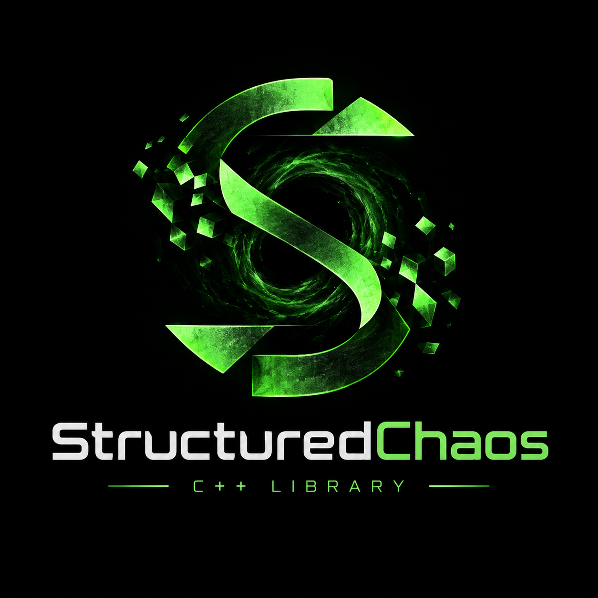

# StructuredChaos

<p align="center">
  
</p>

A compact C++ library featuring modules for ECS, threading, memory management, stats, and more.

## Build & Setup

This project uses **Meson** as its build system.

```bash
# Configure the project and create the build directory
meson setup build

# Build the project
meson compile -C build

# Run tests
meson test -C build
```

## Sanitizers

Sanitizer builds are selected with Meson's built-in `b_sanitize` option and need Clang.
mimalloc is reconfigured to match automatically.

```bash
# AddressSanitizer + UndefinedBehaviorSanitizer
meson setup build-asan --native-file cross/linux-clang.ini -Db_sanitize=address,undefined
meson test -C build-asan

# ThreadSanitizer
meson setup build-tsan --native-file cross/linux-clang.ini -Db_sanitize=thread
meson test -C build-tsan
```

## Dependencies

Key external dependencies

* **EnTT** (ECS Framework)
* **spdlog** (Fast C++ Logging)
* **Catch2** (Testing Framework)
* **mimalloc** (Performance Allocator)
* **glm**, **xsimd**, **simdutf**, **pfr**, **unordered_dense**
